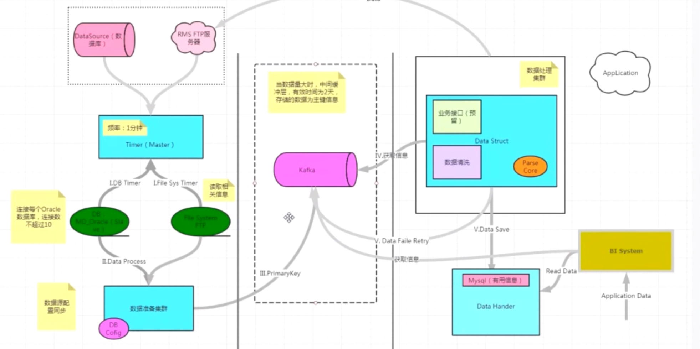

## 时间复杂度

```java
package test.com.luotao.数据结构与算法;
/**
* @Description:
 ## 评价算法的两个指标：
> - 1. 时间复杂度：运行一个程序所花费的时间
> - O(1): 常量阶最优效率，1表示常数，所有能确定的数字都用O(1)
> - O(logn): 对数阶
> - O(n): 线性阶
> - O(nlogn): 线性对数阶
> - O(n^2): 平方阶
> - O(n^n): 指数阶（n的n次方）
> - 2. 空间复杂度：运行程序所需要的内存
* @Author: LuoTao
* @Date: 2025-05-09 07:21:55
**/
class BigO {

/*
    void o1(){
        int a=0;
        int n=3; //这里运行了1次，时间复杂度为O(1)
        for (int i = 0; i < n; i++) { //条件会被检查4次，在第四次的时候跳出循环:i=3 (0 1 2 3)
            a+=1; // 这里运行了3次，时间复杂度为O(1)，因为 n 已经确定了，是常量
        }
    }

    void on(){
        int a=0;
        for (int i = 0; i < n; i++) { // n表示未知,a是一个不确定的变量
            a +=1;// 这里运行n次，时间复杂度为O(n)
        }
    }

    void logn(){
        int i=1;
        while(i <= n){
            i = i * 2; // i的值：2^1 2^2 2^3 2^4 ... 2^x，所以这里运行x次
            */
/**
             对数的性质: log_b(b^a)=a
             2^x=n 求x：
             > 对原方程两边取以2为底的对数得到：log_2(2^x)=log_2(n)
             > 根据对数的性质化简得到：x=log_2(n)
             > 由于计算机忽略掉常数，所以这里时间复杂度为O(logn)
             **//*

        }
    }

    void nlogn(){
        int i=1;
        for (int j = 0; j < n; j++) { // n表示未知
            while(i <= n){
                i = i * 2; // 内层循环的时间复杂度为O(logn)，循环结束后时间复杂度为O(nlogn)
            }
        }
    }

*/


    /***
    * @Description: 判断一个数是否是 2 的 N 次方
    在二进制下，2 的 N 次方的数只有一个 1，其余都是 0。

    - 例如：1（0001）、2（0010）、4（0100）、8（1000）、16（10000）……

    如果 n 是 2 的 N 次方，那么 n-1 的二进制会把这个唯一的 1 变成 0，后面全变成 1。

    - 例如：8（1000）-1 = 7（0111）

    把 n 和 n-1 做按位与（&），结果一定是 0。

    - 8 & 7 = 1000 & 0111 = 0000
    * @Author: LuoTao
    * @Date: 2025-05-13 01:26:03
    **/
    public static boolean isPowerOfTwo(int n) { //O(1)
        // 0 不是 2 的 N 次方，所以要先排除
        if (n <= 0) {
            return false;
        }
        // 利用位运算判断是否为 2 的幂
        return (n & (n - 1)) == 0;
    }


    public static void main(String[] args) {
        int counti=0;
        int countj=0;
//        int n=0; // 内层循环体执行 n 次
//        int n=1; // 内层循环体执行 n-1 次
        int n=2; // 内层循环体执行 n-2 次
        int i=0;
//        int i = n;
        for (; i < n; i++) { // 条件会被检查  n + 1 次（最后一次判断不满足条件退出循环），外层循环体执行了 n 次
            System.out.println("i=" + i);
            // i=0  内层循环体执行了 n 次
            // i=1  内层循环体执行了 n-1 次
            // i=2 内层循环体执行了 n-2 次
            // i=n 内层循环体执行了 n-i 次
            counti += 1;
            int countinner = 0;
            for (int j = i; j < n; j++) { //n n-1 n-2  当i=n时内层循环体执行 n-i 次
                System.out.println("    j=" + j);
                countj += 1;
                countinner += 1;
            }
            System.out.println("    当前内层循环执行次数" + countinner);
        }
        System.out.println("==================================" );
        System.out.println("O(n)外层循环体执行总次数n" + counti);
        System.out.println("O(n²)内层循环体执行总次数" + countj);
        // 总和 = 项数 × (首项 + 末项) ÷ 2
        // n + (n-1) + (n-2) + ... + 2 + 1= n(n+1)/2
    }
}

```

## 手撕数组栈

```java
package test.com.luotao.数据结构与算法.myheapandstack;

import java.util.Scanner;

/**
 * @Classname MyStack
 * @Description
## 栈（Stack）?
> - 数组和链表暴露太多接口，实现上太灵活，理解不到位可能出错，在某些特定场景，比如只能操作端和尾数据可以使用栈，比如浏览器的前进和后退功能。
> - Last in first out 后进先出，即先进后出，只能从栈顶（top）插入（push入栈）和删除元素（pop出栈）
：比如在放盘子的时候都是从下往上一个一个放，拿的时候从上往下一个一个的拿，不能从中间抽，即后进先出
> - 一个限定仅在表尾增删的线性表，这一端被称为栈项，把另一端称为栈底
> - 把新元素放到栈顶叫进栈，把栈顶元素删除叫出栈O(1)
> - 每个线程拥有自己的私有栈。
> - 存储方法调用时的局部变量、基本类型、参数传递、方法调用过程中的`上下文`等信息,因为栈的速度比堆`快`，而且栈的数据可`共享`。
> - 局部变量如果是基本类型，直接保存值；如果是引用类型，则保存指向堆中对象的`引用`。
> - 方法执行完毕后，栈帧自动弹出，局部变量随之销毁。

## 用栈来实现计算器，比如 `2*(3+(4*5))`
> 遍历表达式字符：逐个读取输入字符串中的字符
> 操作数栈:
>   - 如果是数字，则持续拼接成完整的多位数，然后压入操作数栈
> 运算符栈:
>   - 运算符栈为空或栈顶是左括号 '('，则直接将当前运算符压入栈
>   - 否则，比较当前运算符与栈顶运算符的优先级:
>       - 遇到右括号 ')'，则不断弹出运算符并计算，直到遇到左括号为止（左括号不参与计算，仅作为边界标识）
>       - 若当前运算符优先级更高，则压入栈
>       - 否则，弹出栈顶运算符，并从操作数栈中弹出两个操作数进行计算，将结果重新压入操作数栈，继续比较下一个栈顶运算符。
> 遍历结束后，将运算符栈中所有运算符依次弹出并计算

## 如何设计一个浏览器的前进和后退功能？
> 访问新页面:将当前页面压入后退栈，清空前进栈（因为前进历史被破坏）
> 后退栈:点击后退，如果后退栈非空则将当前页面压入前进栈，弹出后退栈的栈顶作为当前页面
> 前进栈:点击前进，如果前进栈非空则将当前页面压入后退栈，弹出前进栈的栈顶作为当前页面


 * @Version 1.0.0
 * @Date 2025/5/11 18:06
 * @Author LuoTao
 */
public interface MyStack<Item> {
    Item push(Item item); // 入栈
    Item pop(); // 出栈
    int size(); // 栈大小
    boolean isEmpty();
}

/**
* @Description: 基于数组的栈，已数组头为栈底
* @Author: LuoTao
* @Date: 2025-05-11 20:23:48
**/
class MyArrayStack<Item> implements MyStack<Item>{
    private Item[] array;    //  数组
    private int n;     //  表示当前栈中元素的实际个数,即已使用的数组长度
    public MyArrayStack(int cap){
        array = (Item[]) new Object[cap];
        n = 0;
    }

    @Override
    public Item push(Item item) { // O(1)
        judgeSize(); //判断是否需要扩容
        array[n++] = item;// 栈顶元素入栈
        return item;
    }

    /**
    * @Description: 判断数组大小扩容
    **/
    private void judgeSize(){
        if (n >= array.length ){  // 当 n（实际元素个数）等于 array.length（数组容量）时，表示数组已经满载，需要先扩容
            resize(array.length * 2); // 扩容为原数组的2倍
        }else if(n >0  && n == array.length / 2){
            // 当 n（实际元素个数）等于 array.length（数组容量）的一半时，表示数组已经半满，需要先缩容，因为数组new出来的内存并不会自动释放，所以需要手动释放。
            resize(array.length / 2);
        }
    }
    /**
    * @Description: 将旧数组 array 中的元素复制到新数组 temp
     * @param size 扩容后的数组长度
    **/
    private void resize(int size){ // 扩容O(n)
        Item[] temp = (Item[]) new Object[size]; // 临时数组
        for (int i = 0; i < n; i++) {
            // 将旧数组 array 中的元素复制到新数组 temp 的对应位置。
            temp[i] = array[i];
        }
        array = temp; // 将新数组赋值给 array
    }

    @Override
    public Item pop() { // O(1)
        if (isEmpty()) {
            return null; // 已经全部出栈了
        }
        Item item = array[--n]; // 把栈顶元素删除出栈，--n这个表达式的值为n-1，即递减后的值，也就是当前栈顶元素第二个元素，也是数组的倒数第二个元素。
        array[n] = null; // 释放栈顶元素引用：将删除的元素置为 null，以方便GC回收。n是数组长度，执行 --n 后，n 的值变为 n-1，这里是原始栈顶元素，即数组的倒数第一个元素。
        return item; // 返回
    }

    @Override
    public int size() {
        return n; // 返回栈中元素的个数，即数组a的大小
    }

    @Override
    public boolean isEmpty() {
        return n == 0; // 栈中元素的个数，即数组a的大小是否为0
    }

    public void print(){
        for (int i = 0; i < n; i++) {
            System.out.print(array[i] + " ");
        }
    }
}

/**
 * @Classname BracketMatchStack
 * @Description
## 设计一个括号匹配的功能？
> 基于数组栈实现括号匹配，比如给一串括号判断是否符合括号原则。
> 利用栈后进先出的特性，用栈保存尚未匹配的左括号，转成字符数组遍历逐个读取每个字符
> 遇到左括号（{, (, [）就压入栈，遇到右括号（}, ), ]）时，判断栈顶元素是否为对应的左括号，若匹配则出栈。
 */
 class BracketMatchStack {
    /**
     * @Description
     * @return boolean
     * @param str 待匹配的字符串
     **/
    public static boolean isOk(String str)
    {
        MyArrayStack<Character> brackets = new MyArrayStack<>(20);
        char c[] = str.toCharArray();// 字符串转数组
        Character top;// 栈顶元素
        for(char x : c){ //O(n)
            switch (x){
                case '{':
                case '(':
                case '[':
                    brackets.push(x);//  入栈O(1)
                    break;
                case '}':
                    top =  brackets.pop();
                    if (top == null) {
                        return false;
                    }
                    if (top == '{') {
                        System.out.println(x + "匹配成功,已出栈");
                        break; // 匹配成功
                    }else{
                        return false;
                    }
                case ')':
                    top =  brackets.pop(); // O(1)
                    if (top == '(') {
                        break;
                    }else{
                        return false;
                    }
                case ']':
                    top =  brackets.pop();
                    if (top == '[') {
                        break;
                    }else{
                        return false;
                    }
                default:
                    break;
            }
        }
        return brackets.isEmpty();
    }
}

class Test{
    public static void main(String[] args) {
        Scanner scanner = new Scanner(System.in);
        while (scanner.hasNext()){
            String next = scanner.next();
            System.out.println(BracketMatchStack.isOk(next));
        }
    }
}


```

```java
package test.com.luotao.数据结构与算法.myheapandstack;

/**
 * @Classname HeapAndStack
 * @Description 堆栈
## 堆内存（Heap）?

> - 所有线程共享的一块内存区域。
> - 垃圾回收器（GC）自动管理堆内存。
> - 存储对象实例（包括数组）。
> - 生命周期由对象决定，当对象不再被引用时，可能会被回收。


 * @Version 1.0.0
 * @Date 2025/5/10 16:21
 * @Author LuoTao
 */
public class HeapAndStack {
    public static void main(String[] args) {
        String str1 = "abc"; // 在栈中创建变量 str1，先不会创建 abc 而是先在栈中找有没有 abc，如果有直接指向，否则就加一个 abc 进来。
        String str2 = "abc"; // 创建一个变量 str12,直接指向已有的 abc
        System.out.println(str1 == str2); // true

        str1 = "bcd"; // str1 指向一个新的 bcd,而 str2 仍然指向 abc
        System.out.println(str1 == str2); // false,虽然栈的数据可`共享`，但是每个线程拥有自己的私有栈，不会影响 str2

        String str4 = "bcd";
        System.out.println(str1 == str4); // true,str1 和 str4 指向同一个bcd,并没有新建对象

        str1 = new String("abc");
        System.out.println(str1 == str2); // false,new 在存储在堆内存中，新开了一个对象，而 str2 仍然在栈内存中

        String s1 = "ja";
        String s2 = "va";
        String s3 = "java";
        String s4 = s1 + s2;// 加号在 JDK 是做了重载的，调用了线程不安全的 StringBuilder（性能更高，在绝大多数字符串拼接场景中，都是单线程操作） 的 append 方法，会 new 对象，所以 s4 是在堆内存中创建的，s3 是在栈内存中创建的
        System.out.println(s3 == s4 ); // false
        System.out.println(s3.equals(s4) ); // true,只比较值
    }
}

```

## 手撕数组源码

```java
package test.com.luotao.数据结构与算法.myarray;

import java.io.*;
/**
 * @Classname MyArray
 * @Description
## ArrayList数组？
> - JDK封装了数组，并且封装了数组的扩容机制。
> - 往中间增删O(N)元素效率很低，因为数组是连续的内存块，存储相同类型的数据，为了保证连续性会涉及元素的移动过程（大量的数据搬移）。
> - 查询效率高O(1)，因为支持随机访问，即可以通过下标定位到数组中的某一个元素，可以借助CPU的缓存机制（通过下标计算寻址公式）,预读数组中的数据。
> - 如果知道数据的大小又很关注性能，就选用数组。数组需要关注的就是越界。
> - 数组声明后大小固定，如果需要申请更大的内层，则需要将原数组拷贝，而链表没有大小的限制。

## 为什么数组的下标要从0开始？
> - 理论上的合理选择,是基于计算机底层原理和性能优化的结果，CPU 寻址方式天然支持偏移量从0开始。
> - 数组是连续的内存块,访问任意元素的地址可以通过公式计算  address = baseAddress(基地址:第一个元素的地址就是这块内存的起始地址) + index(数组元素的下标) * elementSize(数组的长度)
> - 如果从0开始，那第一个元素的地址就刚好是 baseAddress + 0 * elementSize = baseAddress，也就是数组的起始地址。这种计算非常直接，不需要额外处理。
> - 如果从1开始，那每次访问都要做一次减法：index - 1，才能得到正确的偏移量，这就增加了不必要的开销。

## 二维数组的内层地址？寻址公式？


 *
 * @Version 1.0.0
 * @Date 2025/5/9 11:13
 * @Author LuoTao
 */
public class MyArray {
    /**
     * @Description 用数组实现统计文件中的年龄段出现的次数,年龄和数组下标对应
     **/
    public static void countAge() throws IOException {
        String str = null;
        String fileName = "D:\\workspace\\java-projects\\java-source-learn\\src\\test\\数据结构与算法\\data.txt";
        InputStreamReader inputStreamReader = new InputStreamReader(new FileInputStream(fileName), "UTF-8");

        long startTime = System.currentTimeMillis();
        BufferedReader bufferedReader = new BufferedReader(inputStreamReader);
        int total = 0; // 数组中元素的实际大小
        int[] data = new int[20]; // 存储[1,20]每个值出现的次数
        while ( (str = bufferedReader.readLine()) != null ){ // O(n)
            int age = Integer.valueOf(str);
            data[age] ++; //  每个年龄段出现的次数
            total ++;
        }
        for (int i = 0; i < 20; i++) {
            System.out.println(i + "出现次数:" + data[i]);
        }
        System.out.println("花费时间：" + (System.currentTimeMillis() - startTime) + "ms");
    }


    class ArrayTest{
        private int size;   // 数组长度
        private int data[]; // 保存数据的数组
        private int index;  // data数组实际数据大小

        // 数组初始化
        public ArrayTest(int size) {
            this.size = size;
            this.data = new int[size];
            this.index = 0;
        }

        public void print(){
            System.out.println("index:" + index);
            for (int i = 0; i < index; i++) {
                System.out.println(data[i] + " ");
            }
            System.out.println();
        }

        /**
         * @Description
         * 1 判断数组是否还有空间：
         *      1.1 如果没有则扩容
         *      1.2 如果有空间存储，将插入位置loc之后的数据后移
         * 2 插入成功则元素个数+1
         * @Author LuoTao
         * @Date 2025/5/10 15:13
         * @return void
         * @param loc 插入元素的位置
         * @param n
         **/
        public void insert(int loc,int n){ // O(n)
            if (index ++ < size){ // 判断是否有空间存储否则扩容
                for (int i = size -1; i > loc; i--) { // 将插入位置loc之后的数据后移;size -1表示最后一个元素；
                    data[i] = data[i - 1]; // 数据后移
                }
                data[loc] = n; // 当size -1==loc时，直接赋值插入数据不用数据后移
                index ++; // 元素个数加1
            }
            // TODO: 扩容
        }

        /**
         * @Description
         * 1 判断删除元素位置是否为最后一个元素
         *      1.1 当删除元素位置不为最后一个元素时，数据前移；
         *      1.2 当删除元素位置为最后一个元素时，删除最后一个元素。
         * 2 删除成功则元素个数-1
         * @Author LuoTao
         * @Date 2025/5/10 15:11
         * @return void
         * @param loc 删除元素的位置
         **/
        public void delete(int loc){// O(n)
            for (int i = loc; i < size; i++) {
                if(i != size -1){ // 当删除最后一个元素时，不能数据前移
                    data[i] = data[i + 1]; // 数据前移
                }else{
                    data[i]=0; // 删除最后一个元素
                }
            }
            index --; // 删除元素，元素个数减1
        }

        public void update(int loc,int n){// O(1)
            data[loc] = n;
        }

        public int get(int loc){// O(1)
            return data[loc];
        }

    }
}

```


## 手撕链表源码

```java
package test.com.luotao.数据结构与算法.mylinkedlist;

/**
 * @Classname MyLinkedList
 * @Description 手写链表
## 链表？
> - 将一组零散的内存块(结点)串联在一起，每个结点除了存储数据外，还记录链上的下一个结点的地址。
> - 链表有三种经典的结构：单链表、双链表和循环链表
> - 查询效率低O(n)，因为链表没有数组那样的CPU缓存寻址,没有直接的索引访问方式，只能从头结点遍历到尾结点。
> - 头结点：记录链表的基地址，通过它可以遍历得到整条链表
> - 尾结点：指针指向一个空地址NULL,表示最后一个结点

## LinkedList单链表？
> - 增删效率高，如果要增删某一个元素，不需要像数组那样移动元素，只需要修改结点的指针即可。
> - 如果要插入的元素在链表的尾部，那和数组的效率一样O(n)
> - 头插法：
>   - 创建新结点
>   - 新结点指向头结点
>   - 新结点赋值为头结点
> - 中间插法:
>   - 遍历链表，从头结点开始遍历,找要插入位置的节点的前一个结点
>   - 创建新结点
>   - 注意不能直接指向新结点（会导致后面的数据丢失），需要将后面的结点与新节点建立连接保证不断链，即将新结点的指针指向遍历到的结点的下一个，即要插入位置上的结点。
>   - 将遍历到的结点指向这个新结点

## 如何设计一个LRU缓存淘汰算法？
> - Least Recently Used，即最近最少使用
> - 遍历单链表，如果找到了就删掉然后插入到头部，那头部就是最新的
> - 如果不在则先判断LRU是否还有空间，如果有则插入到头部，没有空间则删除最后一个结点。

## 用单循环链表实现约瑟夫问题
> N 个人围成一圈，从第一个人开始报数。
> 每数到第 M 个时，该人将被“杀掉”并离开圈子。
> 下一个人继续从 1 开始报数，直到最后只剩下一个人
> - 循环链表是特殊的单链表，只是最后一个结点的指针指向头结点。

 * @Version 1.0.0
 * @Date 2025/5/11 0:12
 * @Author LuoTao
 */
public class MyLinkedList {
    private ListNode head; // 头结点
    private int size ; //  链表长度
    public MyLinkedList(){
        this.head = null;
        this.size = 0;
    }
    /**
     * @Description O(1)
    > - 头插法：
    >   - 创建新结点
    >   - 新结点指向头结点
    >   - 新结点赋值为头结点
     **/
    public void insertHead(int data){
        ListNode newNode = new ListNode(data);  // 创建新结点

        if(head == null){       // null说明插入的是头结点
//            newNode.next = null;   // 新结点作为头结点指向null表示它是最后一个结点（可省略，构造函数已初始化为 null）
            head = newNode;     // 新结点即是头结点
        }else{
            newNode.next = head; // 新结点指向头结点
            head = newNode;     // 新结点赋值为头结点
        }
    }
    /**
     * @Description O(n)
    > - 中间插法:
    >   - 遍历链表，从头结点开始遍历,找要插入位置的节点的前一个结点
    >   - 创建新结点
    >   - 注意不能直接指向新结点（会导致后面的数据丢失），需要将后面的结点与新节点建立连接保证不断链，即将新结点的指针指向遍历到的结点的下一个，即要插入位置上的结点。
    >   - 将遍历到的结点指向这个新结点

     **/
    public void insertMiddle(int data,int loc){
        if(loc == 0){ // 如果插入位置为0，则头插法
            insertHead(data);
        }else{
            // 遍历链表，【！！！找要插入位置的节点的前一个结点！！！】
            ListNode cur = head;   // 从头结点开始遍历，循环第一次时cur指向第二个结点，所以从i=1开始循环
            for (int i = 1; i < loc; i++) { // 遍历到要插入位置的前一个结点，所以循环条件为i<loc
                cur = cur.next; // i = loc-1 时cur指向要插入位置的前一个结点
            }
            ListNode newNode = new ListNode(data);  // 创建新结点
            newNode.next = cur.next; // 【！！！将新结点的指针指向遍历到的结点的下一个，即要插入位置上的结点！！！ 千万不能用 cur.next = newNode ,因为这样会导致cur后面的数据丢失】
            cur.next = newNode; // 将遍历到的结点指向这个新结点
        }
    }
    /**
     * @Description 删除链表的头部 O(1)
     **/
    public void deleteHead(){
        // 千万不能 this.head = null，因为这会导致断链，需要将头结点的指针指向下一个结点
        this.head = this.head.next;
    }
    /**
     * @Description 删除链表的中间位置结点 O(n)
     **/
    public void deleteMiddle(int loc){
        if(loc == 0){ // 头结点
            deleteHead();
        }else{
            // 遍历链表，【！！！找要删除位置的节点的前一个结点！！！】
            ListNode cur = head;// 从头结点开始遍历，循环第一次时cur指向第二个结点，所以从i=1开始循环
            for (int i = 1; i < loc; i++) {// 遍历到要删除位置的前一个结点，所以循环条件为i<loc
                cur = cur.next;// i = loc-1 时cur指向要删除位置的前一个结点
            }
            cur.next = cur.next.next; // 将遍历到的结点指向下下个结点，即删除它的下一个结点，千万不能 cur.next = null，因为这会导致断链
        }
    }

    /**
     * @Description 根据数据查找结点 O(n)
     **/
    public void find(int data){
        ListNode cur  = head;// 从头结点开始遍历
        int count = 0;
        while (cur != null){
            count++;
            if(cur.value == data) {
                System.out.println("找到结点：" + cur.value + "，位置：" + count);
                break;
            }
            cur = cur.next;
        }
/*        for (; cur != null; cur = cur.next) {
            System.out.println(cur.value + "\n");
        }*/

    }
    /**
     * @Description 打印链表
     **/
    public void print(){
        ListNode cur  = head;// 从头结点开始遍历
        while (cur != null){
            System.out.println(cur.value + "\n");
            cur = cur.next;
        }
/*        for (; cur != null; cur = cur.next) {
            System.out.println(cur.value + "\n");
        }*/

    }


}
/**
* @Classname ListNode
* @Description 结点
**/
class ListNode{
    int value;      // 结点的值
    ListNode next;  // 结点的指针
    ListNode(int value){
        this.value = value;
        this.next = null; // 初始化指针为null
    }
}

```


## 手撕队列源码

```java
package test.com.luotao.数据结构与算法.myqueue;

/**
 * @Classname MyArrayQueue
 * @Description 基于数组实现顺序队列

## 队列(Queue)？
> 排队买票，先来的先买，后来的站队尾，不允许插队
> first in first out 先进先出的线性表，顺序（单向）队列只允许在表的队头（front）出队（dequeue），在队尾（rear）入队（enqueue）
> 与栈的先进后出（栈只能从栈顶插入和删除元素）相反。

## 线程池里面的任务满时，又来一个新任务，线程池是如何处理的？具体有哪些策略？这些策略又是如何实现的？

 * @Version 1.0.0
 * @Date 2025/5/12 17:10
 * @Author LuoTao
 */
public class MyArrayQueue {
    private int[] array; // 保存数据的数组
    private int front; // 队头的数组下标
    private int rear; // 队尾的位置，第一次入队时，rear = 0 + 1 = 1
    private int arraySize; // 保存数据的数组的大小
    public MyArrayQueue(int size) {
        this.array = new int[size];
        this.front = 0;
        this.rear = 0;
        this.arraySize = size;
    }
    /**
     * @Description
    >   enqueue入队O(1)：
    >       - 不满队则数据从队尾入队
            >   示例图解：
                        array: [10, _, _, _, _]
                        index:  0   1   2   3   4
                        front = 0
                        rear  = 1
                        → 第一次入队

    >   顺序队列的空间浪费问题（假溢出）:
    >       - dequeue出队后 front 移动，前面的空间无法再被利用
            array: [A, B, C, D, E]
            index:  0  1  2  3  4
            front = 2 ->出队 A、B
            rear  = 5
            → rear == arraySize（5），队满但前两个位置空着无法使用 → 空间浪费！
    >       - 解决方式：
    >           - 在入队的时候如果队满了，就集中移动一次。
    >           当 rear == arraySize（即队列已满），但 front > 0（说明前面有空位），
    >           将队列中的有效元素整体前移，使 front 回到素质索引 0 的位置，从而腾出空间继续入队。
    >           时间复杂度O(n)，但只在必要时才执行，均摊时间仍为 O(1)
            >   示例图解：
                        array: [C, D, E, _, _]
                        index:  0   1   2   3   4
                        front = 0
                        rear  = 3
                        → 可继续入队 F、G、H...

     * @param data 入队数据
     * @Date 2025/5/12 17:10
     * @Author LuoTao
     **/
    public void enqueue(int data){
        if (isFull()){
            System.out.println("队列假溢出，正在解决空间浪费问题...");
            // 解决空间浪费问题O(n)
            // 如果 front == 0 表示真的满了，否则进行整理
            if (front == 0) {
                System.out.println("数组已满，无法插入");
            } else {
                // 整理：把现有数据前移到数组开头
                for (int i = front; i < rear; i++) {
                    array[i - front] = array[i];
                }
                rear -= front;     // 新的队尾位置
                front = 0;         // front 归零
            }
        }else {
            array[rear] = data; // 数据从队尾入队
            rear++; // 第一次入队时，rear=0+1 =1
        }
    }

    /**
     * @Description
     > dequeue出队O(1):
     >  - 队列非空则队头下标后移,即从队头出队
    >   示例图解：
                array: [A, B, C, D, E]
                index:  0   1   2   3   4
                front = 1
                rear  = 5
                → A已出队，front后移，即 front = A的下标+1 = 1

     * @Author LuoTao
     * @Date 2025/5/12 18:07
     * @return int 出队的数据
     **/
    public int dequeue(){
        if (isEmpty()){
            System.out.println("队列为空");
            return -1;
        }else {
            int data = array[front]; // 原队头数据
            front++; // 队头下标后移
            return data;
        }
    }
    /**
     * @Description 判断队列是否为空
    > 顺序队列空的情况:
    >     - front == rear 即队头位置等于队尾位置
        >   示例图解：
                    array: [_, _, _, _, _]
                    index:  0   1   2   3   4
                    front = 0
                    rear  = 0
                    → front == rear → 队列空
     * @Author LuoTao
     * @Date 2025/5/12 18:10
     **/
    public boolean isEmpty(){
        return front == rear;
    }
    /**
     * @Description
    > 顺序队列满的情况:
    >   - rear == arraySize 即队尾的下标等于数组容量
        >   示例图解：
                    array: [A, B, C, D, E]
                    index:  0  1  2  3  4
                    front = 0
                    rear  = 5
                → rear == arraySize（5） → 队列满
     * @Author LuoTao
     * @Date 2025/5/12 22:37
     **/
    public boolean  isFull(){
        return rear == arraySize;
    }
}

```


## 算法思想

## RMS同步系统

> 这个系统同步电商系统，代理商的一些商品库存、销售情况等信息，这些数据有些在SqlServer、有些在FTP，需要将这些数据整合同步到我们的数据仓库，  然后数据汇总到BI（数据分析）平台以支持实时报表和决策分析。 由于数据量很大（每秒几万），先把业务数据丢到Kafka作为消息队列，然后用阻塞队列限流控制数据处理速率，防止下游系统过载。



## 书籍推荐


