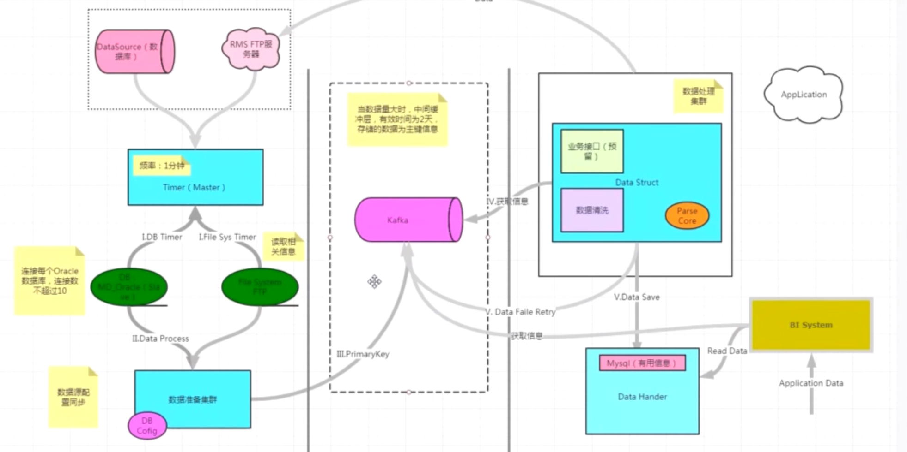

## 判断一个数是否是 2 的 N 次方

在二进制下，2 的 N 次方的数只有一个 1，其余都是 0。

- 例如：1（0001）、2（0010）、4（0100）、8（1000）、16（10000）……

如果 n 是 2 的 N 次方，那么 n-1 的二进制会把这个唯一的 1 变成 0，后面全变成 1。

- 例如：8（1000）-1 = 7（0111）

把 n 和 n-1 做按位与（&），结果一定是 0。

- 8 & 7 = 1000 & 0111 = 0000

```python
def is_power_of_two(n):
    ''' 判断一个数是否是 2 的 N 次方 '''  
    if n <= 0: # 0 不是 2 的 N 次方，所以要先排除
        return False
    return (n & (n - 1)) == 0
```

 ## 评价算法的两个指标？
> - 1. 时间复杂度：运行一个程序所花费的时间
> - O(1): 常量阶最优效率，1表示常数，所有能确定的数字都用O(1)
> - O(logn): 对数阶
> - O(n): 线性阶
> - O(nlogn): 线性对数阶
> - O(n^2): 平方阶
> - O(n^n): 指数阶（n的n次方）
> - 2. 空间复杂度：运行程序所需要的内存

```java
package test.数据结构与算法;
/**
* @Description:
 ## 评价算法的两个指标：
> - 1. 时间复杂度：运行一个程序所花费的时间
> - O(1): 常量阶最优效率，1表示常数，所有能确定的数字都用O(1)
> - O(logn): 对数阶
> - O(n): 线性阶
> - O(nlogn): 线性对数阶
> - O(n^2): 平方阶
> - O(n^n): 指数阶（n的n次方）
> - 2. 空间复杂度：运行程序所需要的内存
* @Author: LuoTao
* @Date: 2025-05-09 07:21:55
**/
class BigO {

/*
    void o1(){
        int a=0;
        int n=3; //这里运行了1次，时间复杂度为O(1)
        for (int i = 0; i < n; i++) { //条件会被检查4次，在第四次的时候跳出循环:i=3 (0 1 2 3)
            a+=1; // 这里运行了3次，时间复杂度为O(1)，因为 n 已经确定了，是常量
        }
    }

    void on(){
        int a=0;
        for (int i = 0; i < n; i++) { // n表示未知,a是一个不确定的变量
            a +=1;// 这里运行n次，时间复杂度为O(n)
        }
    }

    void logn(){
        int i=1;
        while(i <= n){
            i = i * 2; // i的值：2^1 2^2 2^3 2^4 ... 2^x，所以这里运行x次
            */
/**
             对数的性质: log_b(b^a)=a
             2^x=n 求x：
             > 对原方程两边取以2为底的对数得到：log_2(2^x)=log_2(n)
             > 根据对数的性质化简得到：x=log_2(n)
             > 由于计算机忽略掉常数，所以这里时间复杂度为O(logn)
             **//*

        }
    }

    void nlogn(){
        int i=1;
        for (int j = 0; j < n; j++) { // n表示未知
            while(i <= n){
                i = i * 2; // 内层循环的时间复杂度为O(logn)，循环结束后时间复杂度为O(nlogn)
            }
        }
    }

*/


    public static void main(String[] args) {
        int counti=0;
        int countj=0;
//        int n=0; // 内层循环体执行 n 次
//        int n=1; // 内层循环体执行 n-1 次
        int n=2; // 内层循环体执行 n-2 次
        int i=0;
//        int i = n;
        for (; i < n; i++) { // 条件会被检查  n + 1 次（最后一次判断不满足条件退出循环），外层循环体执行了 n 次
            System.out.println("i=" + i);
            // i=0  内层循环体执行了 n 次
            // i=1  内层循环体执行了 n-1 次
            // i=2 内层循环体执行了 n-2 次
            // i=n 内层循环体执行了 n-i 次
            counti += 1;
            int countinner = 0;
            for (int j = i; j < n; j++) { //n n-1 n-2  当i=n时内层循环体执行 n-i 次
                System.out.println("    j=" + j);
                countj += 1;
                countinner += 1;
            }
            System.out.println("    当前内层循环执行次数" + countinner);
        }
        System.out.println("==================================" );
        System.out.println("O(n)外层循环体执行总次数n" + counti);
        System.out.println("O(n²)内层循环体执行总次数" + countj);
        // 总和 = 项数 × (首项 + 末项) ÷ 2
        // n + (n-1) + (n-2) + ... + 2 + 1= n(n+1)/2
    }
}

```

## 数组和链表结构图


## 堆内存（Heap）?

> - 所有线程共享的一块内存区域。
> - 垃圾回收器（GC）自动管理堆内存。
> - 存储对象实例（包括数组）。
> - 生命周期由对象决定，当对象不再被引用时，可能会被回收。

## 栈内存（Stack）?

> - 每个线程拥有自己的私有栈。
> - 存储方法调用时的局部变量、基本类型、参数传递、方法调用过程中的`上下文`等信息,因为栈的速度比堆`快`，而且栈的数据可`共享`。
> - 局部变量如果是基本类型，直接保存值；如果是引用类型，则保存指向堆中对象的`引用`。
> - 方法执行完毕后，栈帧自动弹出，局部变量随之销毁。

```java
package test.数据结构与算法;

/**
 * @Classname HeapAndStack
 * @Description 堆栈
## 堆内存（Heap）?

> - 所有线程共享的一块内存区域。
> - 垃圾回收器（GC）自动管理堆内存。
> - 存储对象实例（包括数组）。
> - 生命周期由对象决定，当对象不再被引用时，可能会被回收。

## 栈内存（Stack）?

> - 每个线程拥有自己的私有栈。
> - 存储方法调用时的局部变量、基本类型、参数传递、方法调用过程中的`上下文`等信息,因为栈的速度比堆`快`，而且栈的数据可`共享`。
> - 局部变量如果是基本类型，直接保存值；如果是引用类型，则保存指向堆中对象的`引用`。
> - 方法执行完毕后，栈帧自动弹出，局部变量随之销毁。

 * @Version 1.0.0
 * @Date 2025/5/10 16:21
 * @Author LuoTao
 */
public class HeapAndStack {
    public static void main(String[] args) {
        String str1 = "abc"; // 在栈中创建变量 str1，先不会创建 abc 而是先在栈中找有没有 abc，如果有直接指向，否则就加一个 abc 进来。
        String str2 = "abc"; // 创建一个变量 str12,直接指向已有的 abc
        System.out.println(str1 == str2); // true

        str1 = "bcd"; // str1 指向一个新的 bcd,而 str2 仍然指向 abc
        System.out.println(str1 == str2); // false,虽然栈的数据可`共享`，但是每个线程拥有自己的私有栈，不会影响 str2

        String str4 = "bcd";
        System.out.println(str1 == str4); // true,str1 和 str4 指向同一个bcd,并没有新建对象

        str1 = new String("abc");
        System.out.println(str1 == str2); // false,new 在存储在堆内存中，新开了一个对象，而 str2 仍然在栈内存中

        String s1 = "ja";
        String s2 = "va";
        String s3 = "java";
        String s4 = s1 + s2;// 加号在 JDK 是做了重载的，调用了线程不安全的 StringBuilder（性能更高，在绝大多数字符串拼接场景中，都是单线程操作） 的 append 方法，会 new 对象，所以 s4 是在堆内存中创建的，s3 是在栈内存中创建的
        System.out.println(s3 == s4 ); // false
        System.out.println(s3.equals(s4) ); // true,只比较值
    }
}

```


## HashMap的数据结构？

> JDK1.7-数组+链表
>
> JDK1.8-数组+链表+红黑树

## RMS同步系统

> 这个系统同步电商系统，代理商的一些商品库存、销售情况等信息，这些数据有些在SqlServer、有些在FTP，需要将这些数据整合同步到我们的数据仓库，  然后数据汇总到BI（数据分析）平台以支持实时报表和决策分析。 由于数据量很大（每秒几万），先把业务数据丢到Kafka作为消息队列，然后用阻塞队列限流控制数据处理速率，防止下游系统过载。


